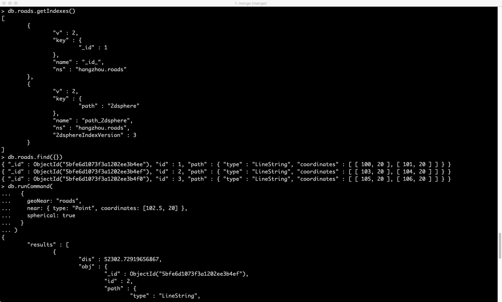

# geoNear-demo
- 利用Python、MongoDB进行地理相关的查询，例如：查询距离西湖银泰最近的10条路。
- 经纬度坐标匹配问题可以用[eviltransform](https://github.com/googollee/eviltransform)转化。

### Demo
- main.py：一个进行mapmatch的应用实例
- test.py：一个简单Demo

### Images
- MongoDB命令行Demo

